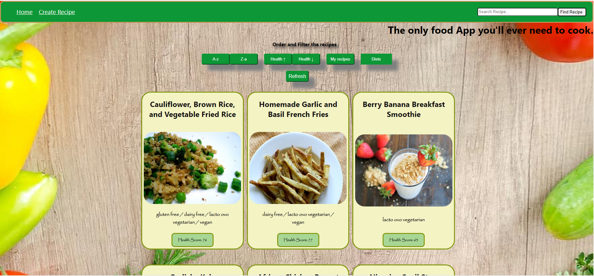

# Individual Project - Henry Food

  

## Objetivos del Proyecto

- Construir una App utlizando React, Redux, Node y Sequelize.
- Afirmar y conectar los conceptos aprendidos en la carrera.
- Aprender mejores prácticas.
- Aprender y practicar el workflow de GIT.

## BoilerPlate

El boilerplate cuenta con dos carpetas: `api` y `client`. En estas carpetas estará el código del back-end y el front-end respectivamente.

## Enunciado

La idea general es crear una aplicación en la cual se puedan ver distintas recetas de comida junto con información relevante de las mismas utilizando la api externa [spoonacular](https://spoonacular.com/food-api) y a partir de ella poder, entre otras cosas:

- Buscar recetas
- Filtrarlos / Ordenarlos
- Crear nuevas recetas propias

#### Tecnologías utilizadas

- [ ] React
- [ ] Redux
- [ ] Express
- [ ] Sequelize - Postgres

No se permite utilizar librerías externas para aplicar estilos a la aplicación. Por ende se utilizó CSS puro)

## Frontend

Se desarrolló una aplicación de React/Redux que contiene las siguientes pantallas/rutas.

__Pagina inicial__

  

__Ruta principal__

  

  

__Ruta de detalle de receta__

  

__Ruta de creación de recetas__

  

## Backend

Se desarrolló un servidor en Node/Express con las siguientes rutas:

- [ ] __GET /recipes?name="..."__:

- [ ] __GET /recipes/{idReceta}__:

- [ ] __POST /recipes__:

- [ ] __GET /diets__:

